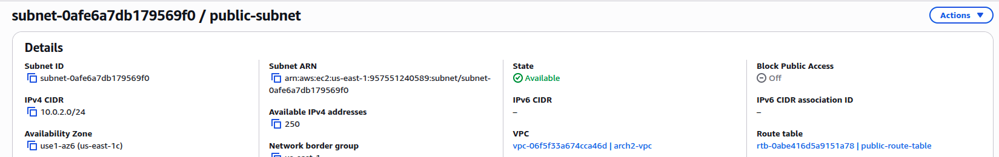
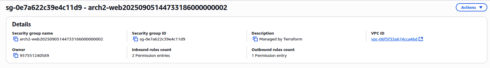

# Terraform Task 6 – Solution

## 📌 Overview
This repository contains my solution to Task 6.  


## 1️Create Arch1
### Requirement
> Create Arch1 using Terraform and ensure all variables are managed using a `*.tfvars` file.

### Solution

- **`provider.tf`**

  ```bash
  terraform {
    required_version = ">= 1.5.0"
    required_providers {
        aws = { source = "hashicorp/aws", version = "~> 5.0" }
     }
  }

  provider "aws" {
    region = var.aws_region
  }
  ```

- **Defined variables in `variables.tf`.**
  ```bash
    variable "aws_region" {   
    type        = string
    description = "AWS region to deploy resources"
    }

    variable "vpc_cidr" {
    description = "CIDR block for VPC"
    type        = string
    #   default     = "10.0.0.0/16"
    }

    variable "public_subnet_cidr" {
    type        = string
    }

    variable "private_subnet_cidr" {
    type        = string
    }

    variable "instance_type"  {
    type = string 
    }

    variable "key_name" {
    type = string 
    }
  ```
  
- **`main.tf` ( VPC, IGW, public+private subnets, NAT GW, routes, one EC2) code in my github repo.**
   - **Arch1 provisions:**
      - VPC
      - Public + Private subnets
      - Internet Gateway + NAT Gateway
      - Route tables
      - Security group
      - One EC2 instance (Ubuntu + Apache).


- **Values are stored in `terraform.tfvars`**

**Run:**
```bash
cd arch1
terraform init
terraform apply -var-file="terraform.tfvars" -auto-approve
```

### Verification Command

#### 1. terraform init


#### 2. `terraform apply -var-file="terraform.tfvars" -auto-approve`


### Verification in AWS

**1. Network (VPC, Public + Private subnets, Internet Gateway + NAT Gateway )**


**Public + Private subnets**


**Route tables**


**Internet Gateway**


**NAT Gateway**


**Security Group**


**EC2 instance (Ubuntu + Apache)**


---

## 2. Research Terraform modules and explore how they can be used for better reusability and maintainability.
*A Terraform module is a collection of standard configuration files in a dedicated directory. Terraform modules encapsulate groups of resources dedicated to one task, reducing the amount of code you have to develop for similar infrastructure components.*

*Some say that Terraform modules are a way of extending your present Terraform configuration with existing parts of reusable code reducing the amount of code you have to develop for similar infrastructure components. Others say that the Terraform module definition is a single or many .tf files stacked together in their own directory. Both are correct.*

*Module blocks can also be used to force compliance on other resources—to deploy databases with encrypted disks, for example. By hard-coding the encryption configuration and not exposing it through variables, you’re making sure that every time the module is used, the disks are going to be encrypted.*


**Why modules?**

- Encapsulate a set of resources (VPC, EC2, autoscaling group, database) into reusable building blocks.

- Promote DRY, enforce consistent patterns and outputs/inputs.

- Allow versioning and sharing (Terraform Registry or private module repo).


**Best practices**

- Keep modules small and single-responsibility.

- Use clear input variables and outputs.

- Use README.md in module to document required vars, outputs, and examples.

- Version modules and pin source with a tag (if using remote registry or git).

- Use terraform fmt, validate, and unit tests where possible.

---

## 3. Using a module, create *Arch2* and install *Nginx* on the machine using Terraform.

### Module: modules/ec2-nginx/
- **main.tf**

  ```bash
  resource "aws_instance" "this" {
    ami                    = var.ami_id
    instance_type          = var.instance_type
    subnet_id              = var.subnet_id
    vpc_security_group_ids = var.sg_ids
    key_name               = var.key_name

    user_data = <<-EOF
      #!/bin/bash
      set -e
      yum update -y
      amazon-linux-extras enable nginx1
      yum install -y nginx
      systemctl enable --now nginx
      echo "<h1>Arch2 via module — Nginx is running</h1>" > /usr/share/nginx/html/index.html
    EOF

    tags = {
      Name = var.name
    }
  }

  ```

- **variables.tf**
  ```bash
  variable "subnet_id" {
    type        = string
    description = "Subnet ID to launch the EC2 instance into"
  }

  variable "sg_ids" {
    type        = list(string)
    description = "List of security group IDs to attach"
  }

  variable "instance_type" {
    type        = string
    description = "EC2 instance type"
  }

  variable "key_name" {
    type        = string
    description = "AWS key pair name for SSH access"
  }

  variable "ami_id" {
    type        = string
    description = "AMI ID for the instance (Amazon Linux 2 recommended)"
  }

  variable "name" {
    type        = string
    description = "Name tag for the EC2 instance"
  }
  ```

- **outputs.tf**
  ```bash
  output "instance_id" {
    description = "ID of the EC2 instance"
    value       = aws_instance.this.id
  }

  output "public_ip" {
    description = "Public IP of the EC2 instance"
    value       = aws_instance.this.public_ip
  }
  ```

### Architecture 2 (Arch2, with module) 

- **arch2/network.tf**
  ```bash
  resource "aws_vpc" "main" {
    cidr_block = var.vpc_cidr
    
    tags = {
      Name = "arch2-vpc"
    }
  }


  # Internet_gateway
  resource "aws_internet_gateway" "this" { vpc_id = aws_vpc.main.id }

  # Public Subnet
  resource "aws_subnet" "public" {
    vpc_id     = aws_vpc.main.id
    cidr_block = var.public_subnet_cidr

    map_public_ip_on_launch = true
    
    tags = {
      Name = "public-subnet"
      Tier = "public"
    }
  }

  # Public Route Table
  resource "aws_route_table" "public" {
    vpc_id = aws_vpc.main.id

    tags = {
      Name        = "public-route-table"
    }
  }

  resource "aws_route" "public_inet" {
    route_table_id         = aws_route_table.public.id
    destination_cidr_block = "0.0.0.0/0"
    gateway_id             = aws_internet_gateway.this.id
  }

  resource "aws_route_table_association" "public_assoc" {
    route_table_id = aws_route_table.public.id
    subnet_id      = aws_subnet.public.id
  }

  # Security Group
  resource "aws_security_group" "web" {
    name_prefix = "arch2-web"
    vpc_id      = aws_vpc.main.id

    ingress {
      from_port   = 80
      to_port     = 80
      protocol    = "tcp"
      cidr_blocks = ["0.0.0.0/0"]
    }

    ingress {
      from_port   = 22
      to_port     = 22
      protocol    = "tcp"
      cidr_blocks = ["0.0.0.0/0"]
    }

    egress {
      from_port   = 0
      to_port     = 0
      protocol    = "-1"
      cidr_blocks = ["0.0.0.0/0"]
    }
  }
  ```
- **arch2/nginx.tf**

  ```bash
  data "aws_ami" "al2" {
    most_recent = true
    owners      = ["amazon"]

    filter {
      name   = "name"
      values = ["amzn2-ami-hvm-*-x86_64-gp2"]
    }
  }

  module "ec2_nginx" {
    source        = "../modules/ec2-nginx"
    name          = "arch2-nginx"
    subnet_id     = aws_subnet.public.id
    sg_ids        = [aws_security_group.web.id]
    instance_type = var.instance_type
    key_name      = var.key_name
    ami_id        = data.aws_ami.al2.id
  }
  ```
**Run:**
```bash
cd arch2
terraform init
terraform apply -var-file="terraform.tfvars" -auto-approve
```

### Verification Command

#### 1. terraform init


 #### 2. terraform apply -var-file="terraform.tfvars" -auto-approve


### Verification in AWS

**EC2 instance (nginx)**


**Network (VPC, Public subnets, Internet Gateway)**


**Public subnets**


**Route tables**


**Internet Gateway**


**Security Group**


